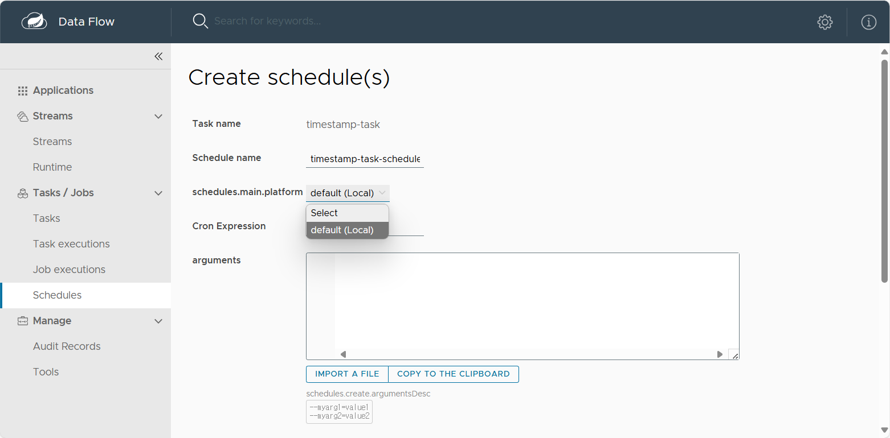

# Spring Cloud Data Flow Quartz Scheduler

> ⚠️ **Warning**: This project is currently under development and not ready for production use. Testing and validation are still in progress.

A scheduling solution for Spring Cloud Data Flow that works in any environment - local, VM, or Kubernetes.

## Why This Project?

Spring Cloud Data Flow only supports scheduling in Kubernetes environments. According to the [official documentation](https://dataflow.spring.io/docs/feature-guides/batch/scheduling/#scheduling-a-batch-job):


This project provides a complete scheduling solution that:
- Works in any environment (local, VM, cloud) without Kubernetes
- Integrates seamlessly with Spring Cloud Data Flow
- Uses Quartz for reliable and flexible scheduling





## Features

- **Simple Setup**: Easy to run in any environment
- **Full Integration**: Works with existing Spring Cloud Data Flow tasks
- **Flexible Scheduling**: Supports cron expressions and various triggers
- **Dashboard**: Includes UI for schedule management
- **High Availability**: Supports clustered environments
- **Job History**: Tracks all task executions

## How It Works

This library automatically configures the Quartz scheduler to be used instead of the local scheduler when the platform type is set to `quartz`. The implementation:

1. Provides a Quartz Scheduler implementation for Spring Cloud Data Flow
2. Automatically creates the necessary database tables
3. Sets the Quartz scheduler as the primary scheduler with higher priority
4. Overrides the local scheduler with a no-op implementation
5. Supports all standard SCDF scheduling operations

## Quick Start

### Prerequisites

- JDK 17+
- Spring Cloud Data Flow Server
- MySQL/PostgreSQL

### Run with Docker

```bash
docker-compose up -d
```

### Run with Gradle

```bash
./gradlew bootRun
```

## Documentation

- [Spring Cloud Data Flow](https://dataflow.spring.io/docs/feature-guides/batch/scheduling/)
- [Quartz Scheduler](http://www.quartz-scheduler.org/documentation/)

## License

MIT License - see the [LICENSE](LICENSE) file for details. 